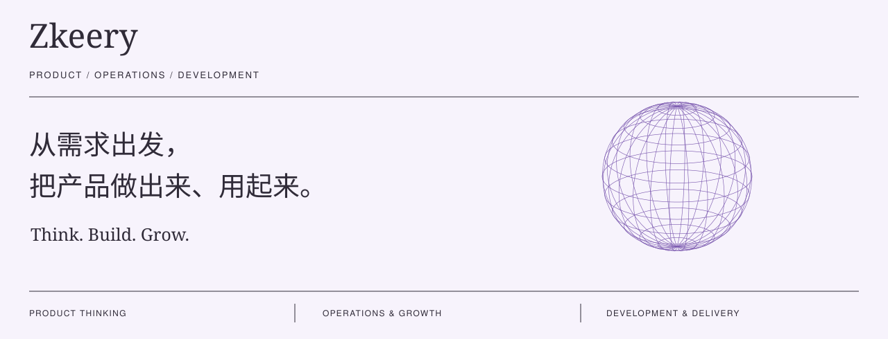

### 关于我 / Prologue

你好，我是 Zkeery，围绕产品、运营与开发展开探索和实践。理解用户需求，动手实现想法，让产品被发现、被使用，再用反馈推动迭代。

在这里记录产品判断、运营增长与开发实践，也关注 AI 工具和开源项目如何帮助想法落地。

---

### 关注方向 / Perspective

| 产品 | 运营 | 开发 |
| :--- | :--- | :--- |
| 找到值得解决的问题。 | 让产品被发现、被使用。 | 把想法变成可用的东西。 |
| 从用户研究与使用场景出发，明确需求与优先级。 | 关注内容、SEO / GEO、转化与留存，用反馈验证增长。 | 拆解开源项目，结合 AI 工具实现原型，持续验证与迭代。 |

### 最近在写 / Notes & Thoughts

2026-09-14 · AI 思考 
[Dario 呼吁放慢 AI，我们还能控制它的速度吗？ ↗](https://mp.weixin.qq.com/s/jsSOinJHopV7sqV3xnCQzQ)

2026-08-30 · 技术观察 
[Anthropic 又搞了个标准，押不押先看这四条 ↗](https://mp.weixin.qq.com/s/1tvOVshXlER1XdlE4X0deg)

2026-08-30 · 内容观察 
[《皇帝吃泡面，大佬交房租，AI漫剧到底靠什么爆》 ↗](https://mp.weixin.qq.com/s/U3Mj3RT9FhxRX1neVbxPDQ)

---

[个人网站 ↗](https://zkeery.github.io/) &nbsp; / &nbsp; [小红书 ↗](https://www.xiaohongshu.com/user/profile/5a6c65b4e8ac2b323a5b7c45) &nbsp; / &nbsp; [给我写邮件 ↗](mailto:a18381518798@gmail.com)
