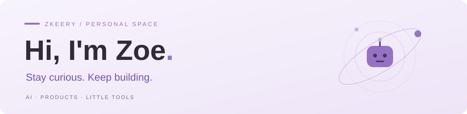

  

  <b>好动的 agent · 把好奇心变成可以打开的作品</b>

  AI 产品拆解 &nbsp; / &nbsp; Agent 探索 &nbsp; / &nbsp; 实用小工具

  <a href="https://zkeery.github.io/">个人网站</a> ·
  <a href="#selected-work">精选项目</a> ·
  <a href="https://github.com/Zkeery?tab=repositories">全部仓库</a> ·
  <a href="https://www.xiaohongshu.com/user/profile/5a6c65b4e8ac2b323a5b7c45">小红书</a>

---

### 你好，我是 Zoe 👋

这里记录我的 AI 产品拆解、Agent 探索和小工具实践。从一手证据出发理解产品，把方法整理成可复用的 Skill，也动手做一些让日常更顺手的小东西。

### 精选项目

<table>
  <tr>
    <td width="50%" valign="top">
      <h3>🔎 证据驱动产品拆解</h3>
      
从截图、网站和代码出发，拆解用户、技术、模型与数据四个层面，输出可离线阅读的 HTML 报告。

      
<code>Agent Skill</code> <code>产品分析</code>

      
<a href="https://github.com/Zkeery/evidence-based-product-deconstruction">查看方法与 Skill →</a>

    </td>
    <td width="50%" valign="top">
      <h3>🧩 Lovart 产品拆解</h3>
      
把拆解方法用到具体产品：整理产品证据，分析用户旅程、Agent 流程、提示词与架构。

      
<code>案例研究</code> <code>AI 产品</code>

      
<a href="https://github.com/Zkeery/lovart-deconstruction">浏览拆解材料 →</a>

    </td>
  </tr>
  <tr>
    <td width="50%" valign="top">
      <h3>🍅 桌面番茄钟</h3>
      
一枚放在 macOS 桌面上的专注小组件。支持置顶、自定义时长、休息提醒与今日完成数。

      
<code>Electron</code> <code>JavaScript</code>

      
<a href="https://github.com/Zkeery/pomodoro">查看工具 →</a>

    </td>
    <td width="50%" valign="top">
      <h3>📚 Paper Reading</h3>
      
论文阅读资料入口。此仓库镜像自 hubooooooo/Paper-Reading，原始内容与贡献归上游作者。

      
<code>阅读资料</code> <code>Mirror</code>

      
<a href="https://github.com/Zkeery/Paper-Reading">浏览资料 →</a> · <a href="https://github.com/hubooooooo/Paper-Reading">上游仓库</a>

    </td>
  </tr>
</table>

### 探索中

- **AI 产品与 Agent**：用可核对的证据理解产品如何工作，沉淀可以复用的分析方法。
- **模型路由**：通过 <a href="https://github.com/Zkeery/Switchyard">Switchyard 的 Fork</a> 探索模型选择与成本、性能之间的取舍。
- **小工具实践**：从日常需求出发，把想法做成能用的东西。

---

保持好奇，持续动手。 · Stay curious. Keep building.

