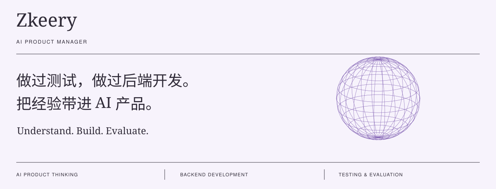

### 关于我 / About

你好，我是 Zkeery，一名有测试和后端开发背景的 AI 产品经理。我关注如何把 AI 能力放进真实场景，让用户更好地完成任务，并让产品效果可以衡量、持续改进。

测试经历让我重视验收标准、异常场景与结果验证；后端开发经历让我理解接口、数据流与系统约束。这些经验帮助我在用户价值、实现成本和交付质量之间做出取舍。

### 我关注的产品能力 / Product Focus

**场景判断与产品取舍**

从用户任务和业务目标出发，判断 AI 能带来什么改善、是否值得引入。明确目标用户、核心流程与成功指标，确定需求优先级和最小可验证范围。

**AI 能力边界与交互设计**

明确模型需要哪些信息、可以调用哪些工具、能够执行哪些操作，以及何时需要用户确认或人工接管。把不确定性落实到交互设计中，让用户知道结果是否可信、出错后如何继续。

**效果评测与质量标准**

把“好用”转化为可验证的标准，围绕真实任务定义评测样本、验收条件与失败场景。综合任务完成率、结果质量、响应时间和使用成本，判断方案是否满足上线要求。

**协作落地与持续迭代**

与算法、研发、设计和业务团队对齐需求、数据条件与系统约束，用原型和实验验证关键假设。上线后结合使用数据与用户反馈定位问题，确定下一步改进的优先级。

### 我的职责边界 / Scope

我关注从问题定义、方案取舍到效果验收的产品闭环。模型选型、架构与实现方式，与算法和研发共同评估；业务规则和可接受的错误范围，与业务团队对齐。产品侧把目标、约束与验收标准说清楚，让每项技术选择都能回到用户和业务结果上。

---

### 最近在写 / Notes & Thoughts

2026-09-14 · AI 思考 
[Dario 呼吁放慢 AI，我们还能控制它的速度吗？ ↗](https://mp.weixin.qq.com/s/jsSOinJHopV7sqV3xnCQzQ)

2026-08-30 · 技术观察 
[Anthropic 又搞了个标准，押不押先看这四条 ↗](https://mp.weixin.qq.com/s/1tvOVshXlER1XdlE4X0deg)

2026-08-30 · 内容观察 
[《皇帝吃泡面，大佬交房租，AI漫剧到底靠什么爆》 ↗](https://mp.weixin.qq.com/s/U3Mj3RT9FhxRX1neVbxPDQ)

---

[个人网站 ↗](https://zkeery.github.io/) &nbsp; / &nbsp; [小红书 ↗](https://www.xiaohongshu.com/user/profile/5a6c65b4e8ac2b323a5b7c45) &nbsp; / &nbsp; [给我写邮件 ↗](mailto:a18381518798@gmail.com)
