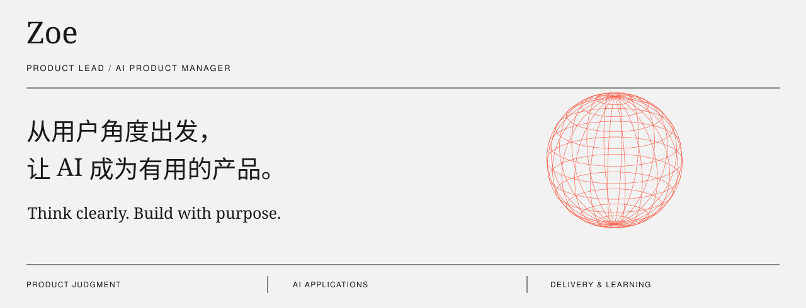

### 关于我 / Prologue

你好，我是 Zoe，产品负责人 / AI 产品经理。关注需求背后的问题，也关注 AI 如何在真实场景中创造价值。

在这里记录对产品、技术和行业的观察，也思考如何把新的 AI 能力转化为用户愿意持续使用的体验。

---

### 关注方向 / Perspective

| 产品判断 | AI 应用 | 产品落地 |
| :--- | :--- | :--- |
| 先理解问题，再定义产品。 | 把模型能力放回真实场景。 | 用真实反馈推进产品。 |
| 关注用户动机、使用成本与业务目标。 | 关注 AI 与 Agent 的能力边界、交互体验和人的参与。 | 从使用反馈与效果评估中做取舍，让迭代有明确依据。 |

### 最近在写 / Notes & Thoughts

2026-09-14 · AI 思考 
[Dario 呼吁放慢 AI，我们还能控制它的速度吗？ ↗](https://mp.weixin.qq.com/s/jsSOinJHopV7sqV3xnCQzQ)

2026-08-30 · 技术观察 
[Anthropic 又搞了个标准，押不押先看这四条 ↗](https://mp.weixin.qq.com/s/1tvOVshXlER1XdlE4X0deg)

2026-08-30 · 内容观察 
[《皇帝吃泡面，大佬交房租，AI漫剧到底靠什么爆》 ↗](https://mp.weixin.qq.com/s/U3Mj3RT9FhxRX1neVbxPDQ)

---

[个人网站 ↗](https://zkeery.github.io/) &nbsp; / &nbsp; [小红书 ↗](https://www.xiaohongshu.com/user/profile/5a6c65b4e8ac2b323a5b7c45) &nbsp; / &nbsp; [给我写邮件 ↗](mailto:a18381518798@gmail.com)
